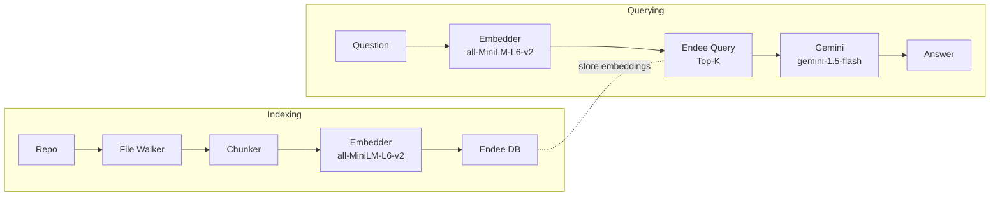
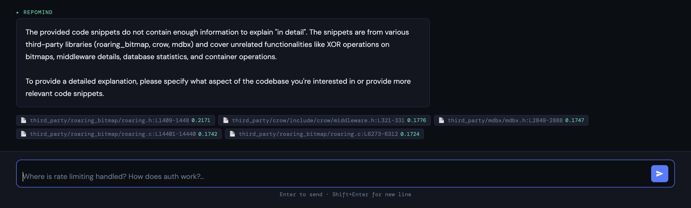

# RepoMind — AI-Powered Codebase Q&A

[](https://www.python.org/)
[](https://fastapi.tiangolo.com/)
[](https://github.com/endee-io)
[](https://ai.google.dev/)

RepoMind turns any codebase into an interactive Q&A experience. It indexes source files into an Endee vector database using sentence-transformers (all-MiniLM-L6-v2) and answers developer questions with Google Gemini. A lightweight FastAPI backend serves the API, and a single-file HTML/CSS/JS frontend provides a chat-style UI.

## Problem Statement
Traditional keyword search misses intent, synonyms, and dispersed logic. Large codebases also span multiple languages and files, so grep-like tools return noisy matches. RepoMind uses dense embeddings and semantic search to retrieve the most relevant code chunks, then synthesizes answers with an LLM, citing file paths and line ranges.

## Features
- Semantic code search with sentence-transformers (all-MiniLM-L6-v2)
- Endee-backed vector index with cosine similarity
- LLM answers via Google Gemini (gemini-1.5-flash)
- Single-file HTML/JS frontend for chat-style Q&A
- REST API (FastAPI) for indexing and asking questions
- Configurable chunking, batch size, and top-k retrieval

## System Architecture



## How Endee Is Used
- Index creation: `create_index(name=INDEX_NAME, dimension=384, space_type="cosine", precision=INT8)` if missing.
- Upsert: batched chunk vectors with metadata `{file, start_line, end_line, language, snippet}`.
- Query: cosine similarity top-k over the index; results drive Gemini prompting.

## Project Structure

```
repomind/
├── src/
│   ├── config.py        # env loading, defaults
│   ├── indexer.py       # walk -> chunk -> embed -> upsert to Endee
│   ├── agent.py         # retrieval + Gemini answer synthesis
│   └── server.py        # FastAPI app (/health, /index, /ask)
├── tests/
│   └── test_devmind.py
├── ui.html              # single-file frontend
├── .env.example         # sample config
├── requirements.txt
└── README.md
```

## Setup

### Prerequisites
- Python 3.12+
- Docker Desktop
- Google Gemini API key (free at https://aistudio.google.com)

### 1. Star & Fork Endee (mandatory)
Go to https://github.com/endee-io/endee → click ⭐ Star → click Fork

### 2. Clone your Endee fork and start the database
```bash
git clone https://github.com/<your-username>/endee
cd endee
```

Replace the `docker-compose.yml` image line with the public image:
```yaml
image: endeeio/endee-server:latest
```

Then start it:
```bash
docker compose up -d
```
Endee is now running at `http://localhost:8080`

### 3. Clone RepoMind
```bash
git clone https://github.com/<your-username>/repomind
cd repomind
```

### 4. Python environment
```bash
python3.12 -m venv .venv
source .venv/bin/activate
pip install -r requirements.txt
```

### 5. Configure environment
```bash
cp .env.example .env
# Edit .env and add your GOOGLE_API_KEY
```

### 6. Start the server
```bash
cd src
uvicorn server:app --reload
```

### 7. Open the UI
Visit `http://localhost:8000/ui.html`

## How to Run

1) **Start the API server** (must run from inside src/):

```bash
cd src
uvicorn server:app --reload
```

2) **Index a repo** (from UI or curl):

```bash
curl -X POST http://localhost:8000/index \
  -H "Content-Type: application/json" \
  -d '{"repo_path":"/absolute/path/to/your/repo"}'
```

3) **Ask a question**:

```bash
curl -X POST http://localhost:8000/ask \
  -H "Content-Type: application/json" \
  -d '{"question":"Where is auth middleware?","top_k":5}'
```

4) **Open the UI** — with the server running, open in your browser:

```
http://localhost:8000/ui.html
```

## UI Preview



## API Reference

| Method | Path     | Body                                      | Description                           |
|--------|----------|-------------------------------------------|---------------------------------------|
| GET    | /health  | –                                         | Service liveness check                |
| POST   | /index   | `{ "repo_path": "/abs/path" }`          | Walk, chunk, embed, upsert into Endee |
| POST   | /ask     | `{ "question": "...", "top_k": 5 }`    | Retrieve top-k chunks and answer      |

## Configuration

| Variable            | Description                                | Default                |
|---------------------|--------------------------------------------|------------------------|
| ENDEE_HOST          | Endee base URL                             | http://localhost:8080  |
| ENDEE_AUTH_TOKEN    | Endee API token (optional)                 | ""                     |
| INDEX_NAME          | Vector index name                          | devmind_code           |
| GEMINI_API_KEY      | Gemini key (or use GOOGLE_API_KEY)         | ""                     |
| GOOGLE_API_KEY      | Alternate env for Gemini                   | GEMINI_API_KEY         |
| LLM_MODEL           | Gemini model name                          | gemini-1.5-flash       |
| CHUNK_SIZE          | Lines per chunk                            | 40                     |
| CHUNK_OVERLAP       | Overlap between chunks                     | 8                      |
| BATCH_SIZE          | Upsert batch size                          | 64                     |
| TOP_K               | Retrieval top-k                            | 5                      |
| SUPPORTED_EXTENSIONS| Comma-separated file extensions            | see .env.example       |
| EXCLUDE_DIRS        | Comma-separated directories to skip        | see .env.example       |

## Example Q&A

User: *"Where is authentication handled?"*

RepoMind:
```
Auth lives in server/auth.py:L10-L72; the middleware attaches `user_id` from the JWT in headers. Routes that require auth are decorated with `require_user` (see server/routes.py:L30-L65). Login flow exchanges email+password for a signed JWT via server/auth.py:L80-L118.
```

## License

Apache-2.0
# GitHub Repo Copilot 🧠

> **Ask your codebase questions in plain English.**  
> GitHub Repo Copilot indexes your entire GitHub repo into [Endee](https://github.com/endee-io/endee) — a high-performance vector database — and lets you query it semantically using natural language.

---

## Problem Statement

Large codebases are hard to navigate. Developers waste hours tracing where logic lives:

- *"Where is rate limiting handled?"*
- *"Which functions touch the payments module?"*
- *"How does authentication flow work?"*

Keyword search (`grep`) can't answer these — it has no concept of meaning. GitHub Repo Copilot solves this with **semantic vector search**: your code is transformed into embeddings, stored in Endee, and retrieved by meaning — not just exact words.

---

## Demo

```
$ python src/agent.py

You: Where is the authentication middleware applied?

GitHub Repo Copilot:
Authentication middleware is applied in `src/app.py:L23-45`. The `@require_auth`
decorator wraps all routes under `/api/v1/...` via FastAPI's dependency injection.
The token validation itself lives in `src/auth/jwt.py:L10-38`.

Sources:
  • src/app.py:L23-45        (similarity=0.921)
  • src/auth/jwt.py:L10-38   (similarity=0.887)
  • src/middleware.py:L5-22  (similarity=0.843)
```

---

## System Design

```
┌─────────────────────────────────────────────────────────────────────┐
│                          INDEXING PIPELINE                          │
│                                                                     │
│  Your Repo  →  File Walker  →  Chunker  →  Embedder  →  Endee DB   │
│  (any lang)    (ext filter)   (overlap)   (MiniLM)    (cosine idx)  │
└─────────────────────────────────────────────────────────────────────┘

┌─────────────────────────────────────────────────────────────────────┐
│                          QUERY PIPELINE                             │
│                                                                     │
│  Question  →  Embedder  →  Endee Query  →  Top-K Chunks  →  Claude │
│  (natural)   (MiniLM)    (cosine search)  (with metadata)  (answer) │
└─────────────────────────────────────────────────────────────────────┘
```

### Components

| Component | Technology | Role |
|-----------|-----------|------|
| Vector DB | **Endee** | Stores and retrieves code chunk embeddings |
| Embedding Model | `all-MiniLM-L6-v2` (sentence-transformers) | Converts code/questions to 384-dim vectors |
| LLM | Claude (Anthropic) | Synthesizes final answers from retrieved chunks |
| API Server | FastAPI | REST interface for indexing and Q&A |
| CLI | Python | Interactive terminal Q&A |

### Why Endee?

Endee is a purpose-built, high-performance vector database capable of handling up to **1 billion vectors on a single node**. GitHub Repo Copilot uses it to:

- Store overlapping code chunks as 384-dimensional cosine-space vectors
- Perform sub-millisecond top-k similarity search at query time
- Maintain chunk metadata (file path, line range, language) alongside vectors for precise source attribution

---

## Technical Approach

### 1. Chunking Strategy

Files are split into **overlapping line-based chunks** (default: 40 lines, 8-line overlap). Overlap ensures that logic spanning chunk boundaries is captured in at least one chunk — preventing semantic gaps.

### 2. Embedding

Each chunk is embedded using `sentence-transformers/all-MiniLM-L6-v2` — a compact (384-dim), fast, and high-quality model well-suited to code and technical prose.

### 3. Endee Indexing

Chunks are upserted in batches into a cosine-space Endee index with `INT8` precision — trading a tiny accuracy margin for significantly faster search.

### 4. Retrieval-Augmented Generation (RAG)

At query time:
1. The question is embedded with the same model
2. Endee returns the top-K most similar chunks (default K=5)
3. Those chunks, with file+line metadata, are passed to Claude as context
4. Claude synthesizes a grounded, source-cited answer

### 5. Idempotent Re-indexing

Chunk IDs are derived from `MD5(filepath + start_line)` — making re-indexing safe and efficient. Endee's `upsert` operation updates existing vectors without duplication.

---

## Project Structure

```
github-repo-copilot/
├── src/
│   ├── config.py      # All settings, loaded from .env
│   ├── indexer.py     # File walker + chunker + Endee upsert
│   ├── agent.py       # Retrieval + LLM synthesis + CLI
│   └── server.py      # FastAPI REST server
├── tests/
│   └── test_devmind.py
├── .env.example
├── requirements.txt
└── README.md
```

---

## Setup & Installation

### Prerequisites

- Python 3.11+
- Docker (to run Endee)
- A Google Gemini API key (https://aistudio.google.com)

### 1. Fork & Clone

Per the mandatory repository steps, first **star and fork** [endee-io/endee](https://github.com/endee-io/endee), then:

```bash
git clone https://github.com/<your-username>/endee
cd endee
```

Clone GitHub Repo Copilot into the same workspace:

```bash
git clone https://github.com/<your-username>/github-repo-copilot
cd github-repo-copilot
```

### 2. Start Endee

The fastest way is Docker Compose:

```bash
# From the endee repo root
docker compose up -d
```

Endee will be available at `http://localhost:8080`.

### 3. Install Python Dependencies

```bash
python -m venv .venv
source .venv/bin/activate   # Windows: .venv\Scripts\activate
pip install -r requirements.txt
```

### 4. Configure Environment

```bash
cp .env.example .env
```

Edit `.env`:

```env
ENDEE_HOST=http://localhost:8080
GOOGLE_API_KEY=your-gemini-key
```

---

## Usage

### Index a Codebase

```bash
# Index any local repo (or the current directory)
python src/indexer.py /path/to/your/repo
```

You'll see live progress as chunks are embedded and upserted into Endee.

### Ask Questions (CLI)

```bash
python src/agent.py
```

Then type any natural-language question:

```
You: Where is error handling centralized?
You: How does the database connection pool work?
You: Which files import the config module?
You: What's the entry point for the background job scheduler?
```

### REST API

Start the API server:

```bash
uvicorn src.server:app --reload
```

**Index a repo:**
```bash
curl -X POST http://localhost:8000/index \
  -H "Content-Type: application/json" \
  -d '{"repo_path": "/path/to/repo"}'
```

**Ask a question:**
```bash
curl -X POST http://localhost:8000/ask \
  -H "Content-Type: application/json" \
  -d '{"question": "Where is rate limiting handled?", "top_k": 5}'
```

**Interactive docs:** `http://localhost:8000/docs`

---

## Running Tests

```bash
pytest tests/ -v
```

---

## Configuration Reference

| Variable | Default | Description |
|----------|---------|-------------|
| `ENDEE_HOST` | `http://localhost:8080` | Endee server URL |
| `ENDEE_AUTH_TOKEN` | _(empty)_ | Auth token (leave empty for open mode) |
| `INDEX_NAME` | `github_repo_copilot_code` | Endee index name |
| `EMBEDDING_DIM` | `384` | Must match the embedding model |
| `CHUNK_SIZE` | `40` | Lines per chunk |
| `CHUNK_OVERLAP` | `8` | Overlap between consecutive chunks |
| `TOP_K` | `5` | Number of chunks retrieved per query |
| `GOOGLE_API_KEY` | _(required)_ | Your Google Gemini API key |
| `LLM_MODEL` | `gemini-1.5-flash` | Gemini model for synthesis |

---

## Supported Languages

Python, JavaScript, TypeScript, Go, Java, Rust, C/C++, C#, Ruby, PHP, Swift, Kotlin, Scala — and easily extensible via `SUPPORTED_EXTENSIONS` in `.env`.

---

## License

Apache-2.0 — same as the Endee base repository.
